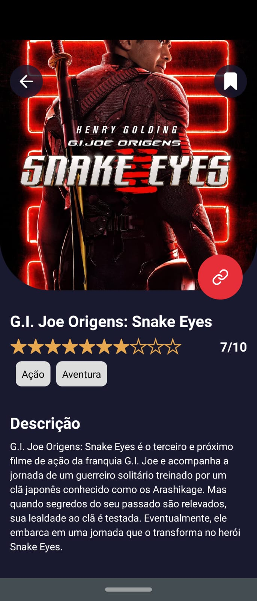
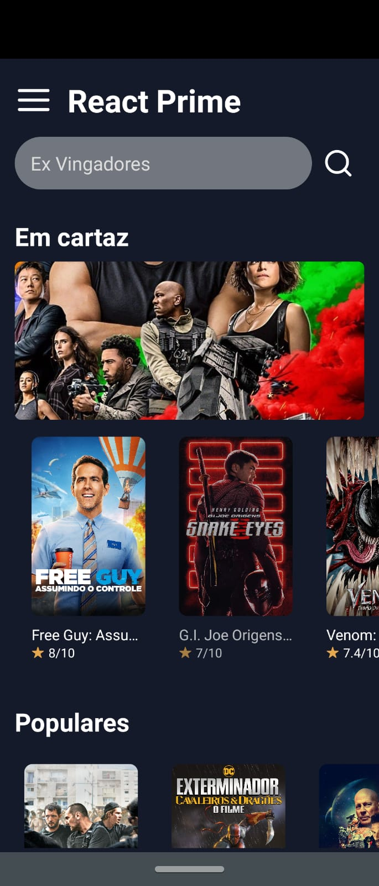

# React Native - Insider 4.0 - Sujeito Programador

Olá, este aplicativo foi feito de acordo com o evento React Native Insider 4.0 - guiado pelo <a href="https://www.youtube.com/channel/UCLc5Bq2yfs-S3Zse3ZFRMEQ"> Sujeito Programador </a>

# Backend

O backend foi construído em cima da API do site <a href="https://www.themoviedb.org/?language=pt-BR"> The MovieDB </a>

# Imagens do Projeto - Rodado em um Motorola One Vision

